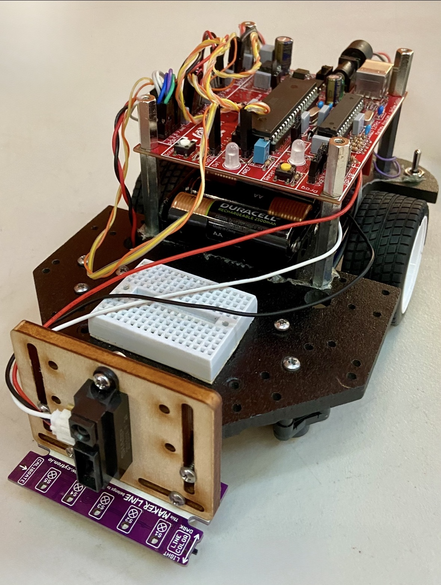
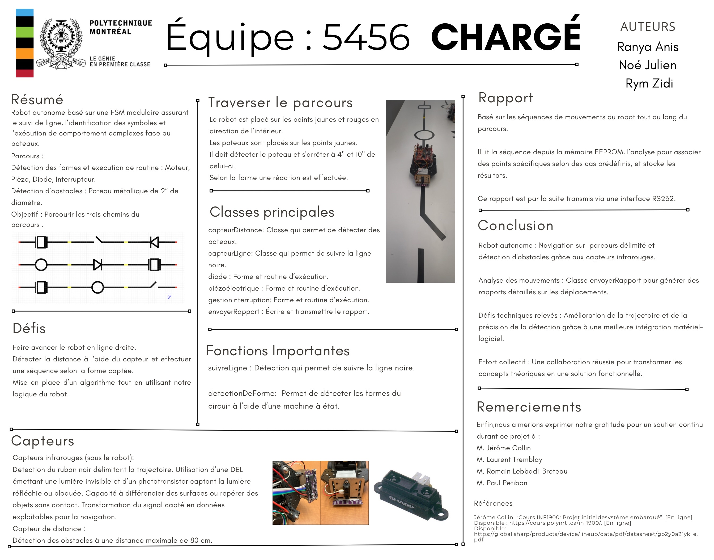
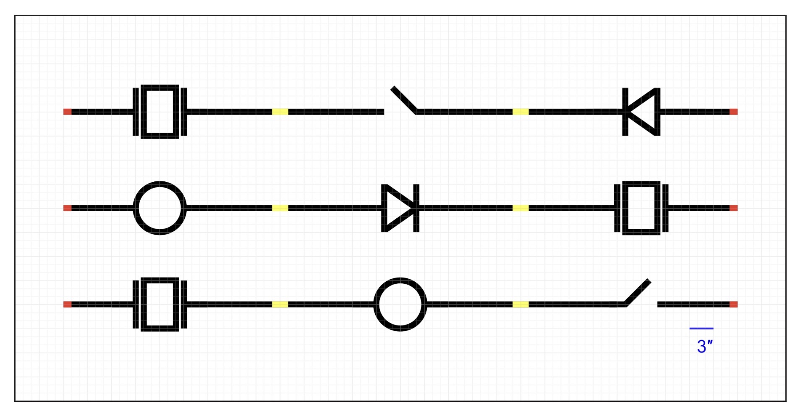
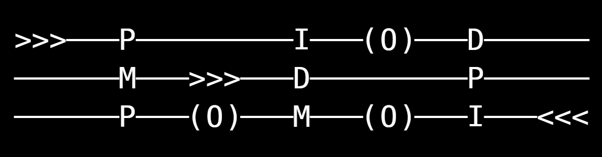

# CHARGÉ — Embedded Systems Robot

  <b>Autonomous line-following robot with symbol recognition, adaptive behaviors, and serial reporting.</b>

  
  
  

  Project completed for <b>INF1900 — Embedded Systems</b> at Polytechnique Montréal.

---

## Project Overview

**CHARGÉ** is an autonomous robot built around a modular finite state machine.  
The robot follows a black line, detects physical symbols placed along its path, reacts differently depending on the symbol encountered, and transmits a final trip report through USART.

This project brought together real-time embedded programming, hardware control, sensor integration, serial communication, and teamwork under physical constraints.

   
  The CHARGÉ robot prototype

  

---

## Path and Symbol Layout

The robot can travel through three different paths. Each path contains physical symbols that trigger specific behaviors once a post is detected after the symbol.

  

The report generated by the robot represents the detected path using symbols such as:

| Symbol | Meaning |
|--------|---------|
| `>>>` / `<<<` | Starting position and direction |
| `(O)` | Detected post |
| `M` | Motor symbol |
| `D` | Diode symbol |
| `P` | Piezoelectric buzzer symbol |
| `I` | Switch symbol |

  

---

## Robot Behavior

The robot starts on a yellow or red point, facing inward.  
As it moves, it uses sensors to follow the line and detect posts placed after specific symbols. When a post is detected, the robot identifies the associated symbol and executes the correct behavior before continuing the path.

| Symbol | Robot Response |
|--------|----------------|
| **Diode △** | Stops at 10 inches, turns on a green LED, waits 2 seconds, then moves closer with a color transition. |
| **Motor ○** | Goes around the post without touching it, then returns to the line. |
| **Piezo □** | Stops at 4 inches, activates the buzzer, then resumes after the post is removed. |
| **Switch _/** | Stops at 4 inches, performs a rotation sequence, then checks if the post was removed. |
| **End of path** | Blinks red/green, then sends the final report through USART after button interruption. |

---

## LED Feedback

The robot uses LED feedback to communicate different states during execution.

<table>
  <tr>
    <td align="center">
       
      Red LED state
    </td>
    <td align="center">
       
      Amber LED state
    </td>
    <td align="center">
       
      Green LED state
    </td>
  </tr>
</table>

---

## Hardware Used

| Component | Role |
|----------|------|
| **ATmega324PA** | Main microcontroller |
| **DC motors** | Robot movement |
| **Infrared sensors** | Line following |
| **Distance sensor** | Post detection |
| **LEDs** | Visual state feedback |
| **Piezo buzzer** | Audio feedback |
| **External EEPROM** | Stores path/report information |
| **USART / RS-232** | Final report transmission |

---

## Code Architecture

The project is structured into independent C++ classes, each responsible for one robot subsystem. This made the code easier to test, debug, and maintain as a team.

| Class | Responsibility |
|------|----------------|
| `DEL` | LED colors and blinking |
| `Interruptions` | External interrupts and Timer1 |
| `Timer` | Timer configuration |
| `USART` | Serial communication |
| `Memoire24CXXX` | External EEPROM read/write |
| `CAN` | Analog-to-digital conversion |
| `PWM` | Motor speed and LED intensity control |
| `RobotMotricite` | Movement: forward, backward, turn, stop |
| `Debug` | Diagnostics and state tracking |

The project builds using Makefiles and links with `librairie1900.a`.

---

## What I Learned

Through this project, I practiced:

- Designing a finite state machine for a real embedded system
- Programming a robot with real-time constraints
- Integrating sensors, motors, LEDs, buzzer, EEPROM, and USART
- Debugging embedded behavior using limited tools such as LEDs and serial output
- Collaborating on a modular C++ codebase in a team setting
- Connecting software decisions to physical robot behavior

---

## Team

Project completed by:

- Ranya Anis
- Noé Julien
- Rym Zidi

Completed for **INF1900 — Projet initial de système embarqué** at Polytechnique Montréal.

---

## Project Status

Completed academic project.  
Final grade received: **A**.